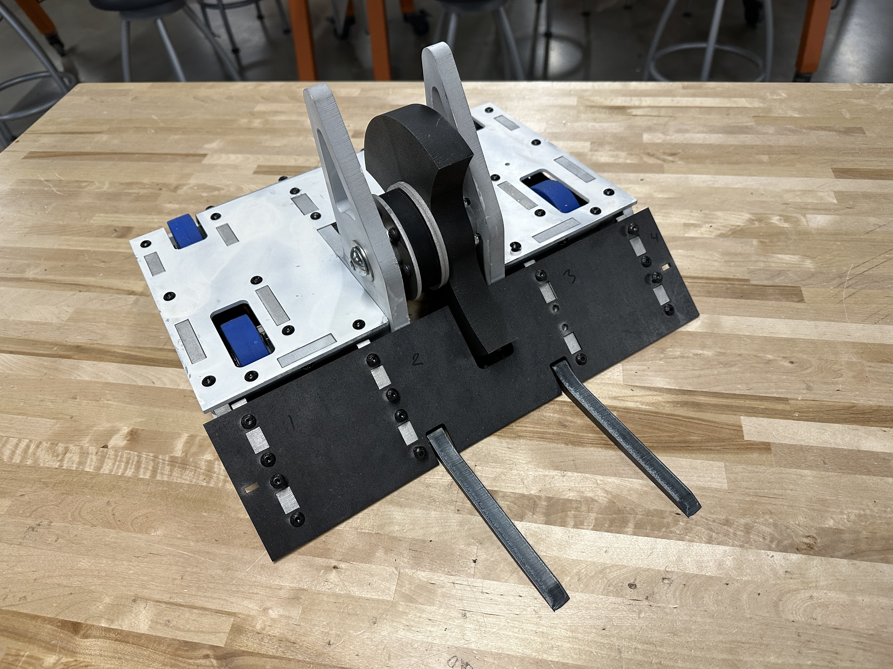

# 30 lb Vertical Spinner Combat Robot

As part of iRobotics at the University of Illinois, I was part of a team that build a new combat robot each school year. This robot,
Caffeine Addiction, was my senior year robot. 
I designed the entirety of the robot in SolidWorks, and worked with one other person who handled the majority
of the wiring and electrical integration. We competed the robot in Robobrawl, the annual combat robot competition hosted by iRobotics, 
in 2023 and I brought the robot back to compete again in 2024. We struggled with electrical issues in our first competion but I secured
a 2nd place finish in 2024. 

## Fight Videos
Some of Caffeine Addiction's fights! 

### Robobrawl 2023

    <!-- Lumber ducky -->
    <iframe width="440" height="240" src="https://www.youtube.com/embed/Otf3NGctwWY" frameborder="0" allow="autoplay" allowfullscreen></iframe>
    <!-- James -->
    <iframe width="440" height="240" src="https://www.youtube.com/embed/glbz3jwq8_U" frameborder="0" allow="autoplay" allowfullscreen></iframe>

 

### Robobrawl 2024
<!-- Apollo -->

    <iframe width="850" height="480" src="https://www.youtube.com/embed/HFXyOjDNC6Y" frameborder="0" allow="autoplay" allowfullscreen></iframe>

    <!-- box of parts -->
    <iframe width="420" height="240" src="https://www.youtube.com/embed/QC6kWUYr3M8" frameborder="0" allow="autoplay" allowfullscreen></iframe>
    <!-- A loss -->
    <iframe width="420" height="240" src="https://www.youtube.com/embed/faq1ZeGHI8Q" frameborder="0" allow="autoplay" allowfullscreen></iframe>

<!-- ## Process -->
<!-- Still need to add some photos / text about building it -->