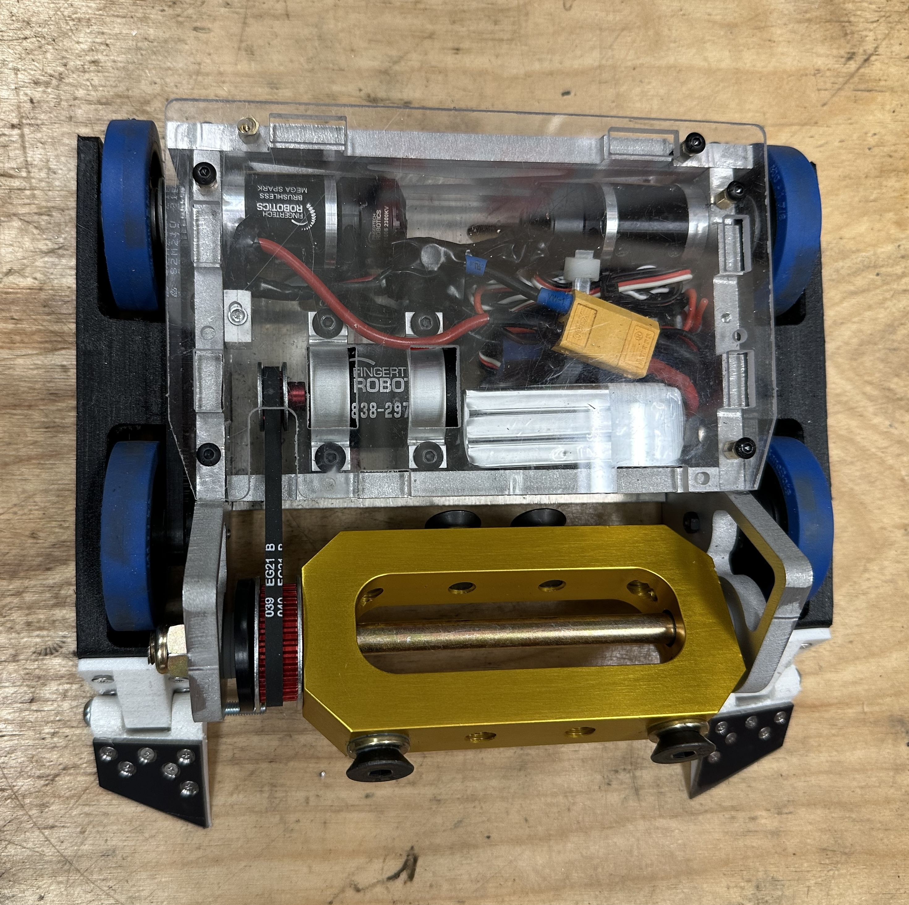

# 3 lb. Combat Robot

    

        
        
Tumble Dry First Iteration

    

    

        
        
Tumble Dry Second Iteration

    

## Overview

This robot, Tumble Dry, was my first personal robot built outside of iRobotics at the University of Illinois. It's a 3lb. beetleweight robot with a vertically spinning "egg-beater" style weapon, meaning it has a wide, flat spinning weapon with a hollowed out center. It's wide design makes it easy to keep the weapon pointed at the opponent, and also makes it harder for opposing weapons to contact my frame. The weapon shape is ideal for storing lots of kinetic energy in a small diameter weapon, allowing it to dish out big hits and still drive while inverted. The robot also has 4-wheel drive, making it both stable and highly maneuverable.

I manufactured the top, bottom, and rear plates out of 1/8" 6061-T6 aluminum on a waterjet. The side plates are waterjet out of 1/2" UHMW, which helps absorb impacts to the weapon and transfers less force into the chassis. The forks are waterjet out of AR500 steel. The wheel covers and fork mounts are 3D-printed out of TPU. 

I soldered all of the electrical components including the three brushless motors for the weapon and drive, the three electronic speed controllers (ESC's), the RC receiver, the battery, and the batter eliminator circuit (BEC).

## Fight Videos

    <iframe width="440" height="240" src="https://www.youtube.com/embed/EB-TLpSR4Pw" frameborder="0" allow="autoplay" allowfullscreen></iframe>
    <iframe width="440" height="240" src="https://www.youtube.com/embed/wy2pZ_m23_Q" frameborder="0" allow="autoplay" allowfullscreen></iframe>

 

Tumble Dry went 3-2, with the final loss to a horizontal spinner. This is the aftermath:
 

Clearly there's some room for improvement. Some changes I have in mind are a titanium wedge for horizontal spinner matchups and switching to cast urethane wheels which are more durable than the banebots ones I'm currently using. I'm not sure yet if I will iterate on this robot or build a new one, but stay tuned for more! 