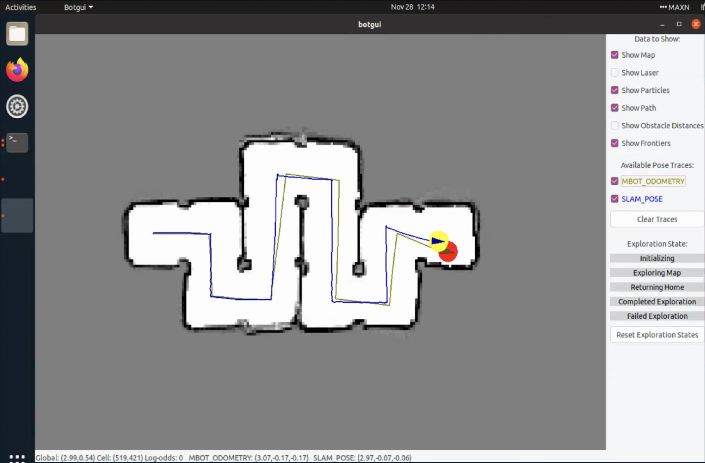
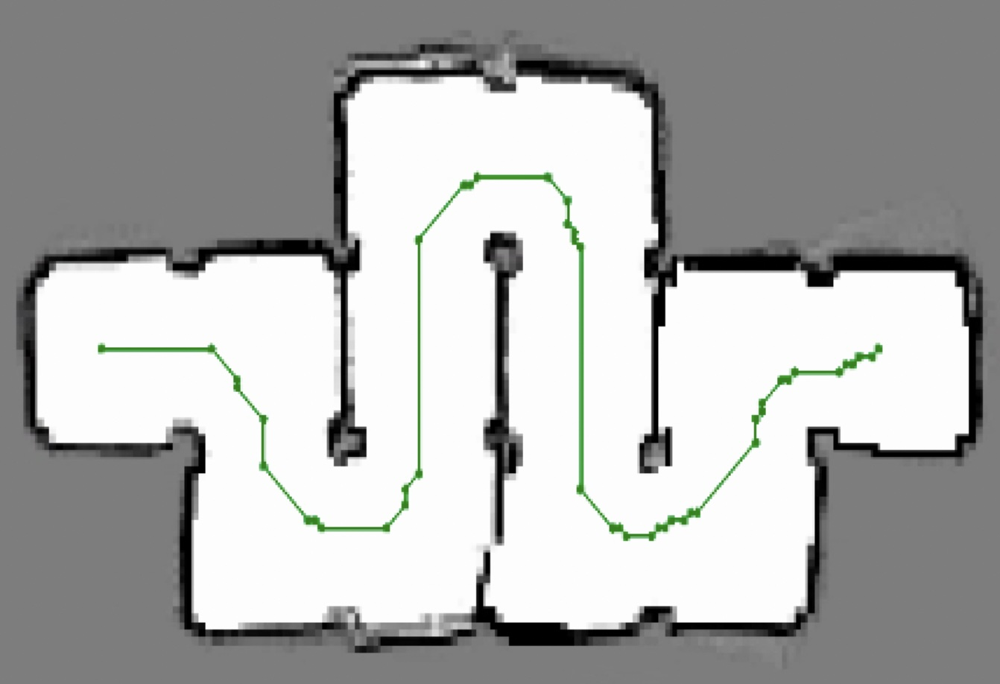
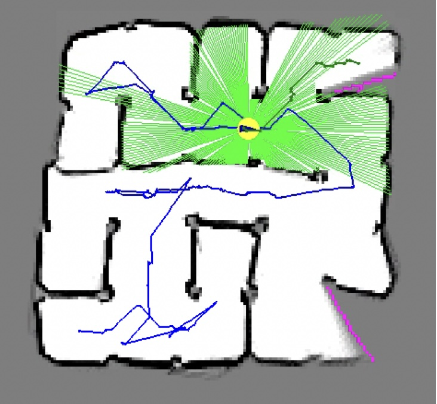

# Autonomous Mobile Robot

## Overview
This was the second of two projects done in my Robotic Systems Lab class at the University of Michigan. The goal was to program a mobile robot to use LIDAR-based SLAM to localize, map, and explore an unknown environment with obstacles. We additionally implemented wheel calibration, PID control for wheel velocity tracking, A* path planning, and computer-vision based object manipulation. I worked on this project with two other students, and played a key role in developing all of the  algorithms.

This page gives a brief overview of the steps leading to autonomous mapping and exploration. 
View our [full report](../media/botlab/botlab.pdf){:target="_blank"} for more technical detail including our detailed methodolgy and mathematical derivations.

### Part 1: Waypoint Tracking & Odometry
In order to have the robot follow a desired path, we implemented wheel calibration, PID tracking of a target linear and angular velocity, and waypoint-based path planning. We also integrated quadrature encoder measurements into a feedback controller for wheel velocity, and used an Intertial Measurement Unit (IMU) to account for wheel slipping when encoder measurements deviated from IMU measurements, improving the accuracy of the robot's odometry. The video below shows the robot navigating beween waypoints. It is continuously calculating the error between its position and heading with the target position, resulting in it performing drastic movements to recover from deviations from the path as it approaches the target. This is not ideal behavior but was fixed later.

    <iframe src="https://drive.google.com/file/d/1CyLvLcyHBEknQ4Ph2Qmnb5wUbwWsnngV/preview" 
            width="800" height="480" 
            allow="autoplay" allowfullscreen></iframe>

 

### Part 2: Simultaneous Localization & Mapping (SLAM)
Our SLAM system uses a particle filter for localization and mapping. It starts by initializing a set of particles in a Gaussian distribution around an estimated starting pose, which can be based on prior knowledge or initial sensor data. Each particle represents a potential state of the robot. As the robot moves and receives new sensor data, the system updates these particles. The update process involves two key steps: first, the action model predicts the new state of each particle based on the robot's movement (using odometry), and second, the sensor model adjusts the weights of the particles based on how well they match the new LIDAR sensor data. Our sensor model uses a likelihood function that assigns Gaussian weights to occupancy grid cells before and past the current ray’s endpoint to account for uncertainties in the previous mapping.

The system periodically resamples the particles to focus on the most probable states. The robot's pose at any given time is estimated based on the highest-weighted particle or the mean of a cluster of high-probability particles, integrating both odometry and sensor information for a robust estimate of the robot's position and orientation. This continuous process of prediction, measurement, and resampling allows the SLAM system to maintain an accurate understanding of the robot's location even in the presence of noise and uncertainty in the sensor data and movements.

Below is an image of the map produced using the SLAM algorithm. It shows the pose predicting using SLAM and just odometry. The SLAM pose is much more accurate. 

 

### Part 3: A* Path Planning and Exploration
The objective of the path planning algorithm is to find the optimal path from the robot’s current position to its goal position while avoiding obstacles in a computationally efficient manner. The algorithm we implemented is an A* algorithm, which combine elements from Djikstra’s algorithm and a greedy best-first algorithm to find the shortest path to the destination to minimize the caveats of either standalone algorithm. Djikstra’s algorithm traverses cells by expanding from the
start node evenly in all directions, which can take a long time to find an optimal path. It is complemented well by a greedy algorithm, which uses a Manhattan distance between the current and the goal cell as a guiding heuristic. These two path planning algorithms are combined in the A* algorithm, which calculates a g-cost based on Djikstra’s algorithm and an h-cost based on the greedy algorithm heuristic. They are added together to calculate a combined f-cost. 

<!-- More specifically, the g-cost is the length of the path in cells from the start cell to the current one. This is computed by defining each cell with a parent and adding one to the parent’s g-cost count each time a new cell is explored. Additionally, this parent can be reassigned to maintain the shortest path to the start. Finally, the distance to the nearest obstacle is added to the g-cost to prioritize exploring cells further from obstacles. The g and h-costs are summed to compute an f-cost.  -->

The A* algorithm is implemented using two priority queues: the open queue keeps track of nodes to traverse, and the closed queue keeps track of nodes that have already been traversed and should not be revisited. For each node in the open queue, the algorithm loops through its neighbors and calculates the f-cost for each. If the node is not already in the closed queue, it is added to the open queue. Additionally, if a node in the open queue is traversed and one of its neighbors has a lower g-cost than its parent node, its parent will now point to that neighbor. Since the priority queue is sorted by f-cost, when the loop repeats it will look at the node in the open queue with the lowest f-cost, thus bringing the traversal closer to the goal. Once the traversal reaches the goal, the path from the start cell to end cell is generated based on the path of parents associated with g-cost from the goal cell to the start, which will always be the optimal path because of how Djikstra’s algorithm reassigns parent nodes.Once this path is created, any straight line segments are pruned to remove uneneccessary waypoints. 

The goal of the exploration algorithm is to navigate to frontiers, which are regions of the grid at the border of unmapped and empty regions. A set of valid frontiers is determined, the robot uses A* to compute a path to the centroid of the nearest frontier region.

Below are images of a path through a maze computed with A*, and a screen grab of the map after the robot has explored most of the map. The travelled path is blue, the planned path is in green, and the frontier regions are pink. LIDAR rays are also visualized in light green.

    
    

## Results
Work in progress